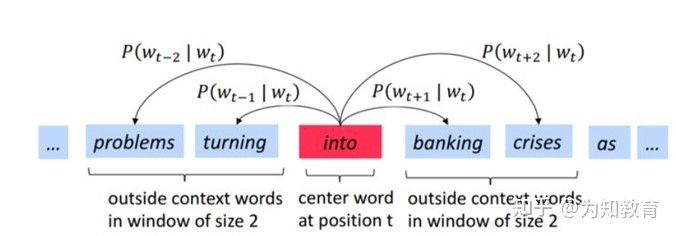
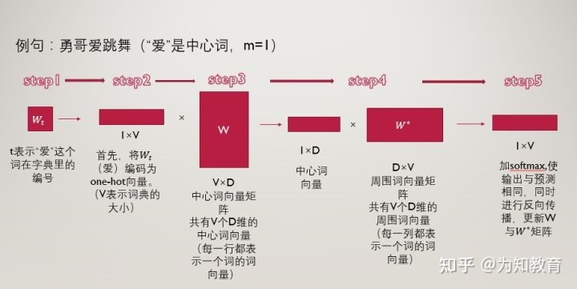
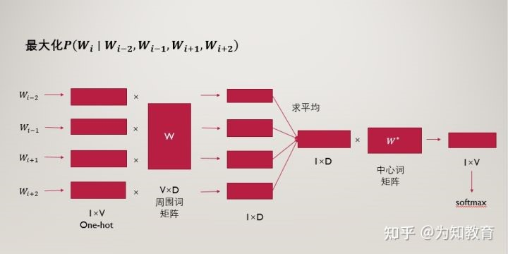

# word2vec学习笔记
重要假设：文本中离得越近的词语相似度越高。

word2vec是一种高效训练词向量的模型
就是用来训练词向量的，有两个训练方案，两个加速手段。

one-hot有缺陷-》用分布式表示-》用词嵌入来得到分布式表示-》著名词嵌入技术word2vec

独热编码 词越多维数越高；无法表示词和词之间关系；

word2vec学出来的权重w就词向量

​word2vec在 2018 年之前非常流行，但是随着 BERT、GPT2.0 等方法的出现，这种方式已经不算效果最好的方法了。

## 基本思想
句子之中相近的词之间是有联系的，比如今天后面经常出现上午、下午。所以它的基本思想就是用词来预测词。（准确的说，word2vec仍然是一种编码方式，将一个个的词给编码成向量，但是被他编码而成的向量并不是随便生成的，而是能够体现这些单词之间的关系（如相似性等））

## word2vec主要包含
**两个模型**：

1.跳字模型（skip-gram）：
用当前词来预测上下文。相当于给你一个词，让你猜前面和后面可能出现什么词。

2.连续词袋模型（CBOW，continuous bag of words）：
通过上下文来预测当前值。相当于一句话中扣掉一个词，让你猜这个词是什么。

**两种训练加速方法**：

1.负采样

2.分层softmax。

### Skip-gram（跳字模型）

 跳字模型的概念是在每一次迭代中都取一个词作为中心词汇，尝试去预测它一定范围内的上下文词汇。
这个模型定义了一个概率分布：给定一个中心词，某个单词在它上下文中出现的概率。我们会选取词汇的向量表示，从而让概率分布值最大化。重要的是，这个模型对于一个词汇，有且只有一个概率分布，这个概率分布就是输出，也就是出现在中心词周围上下词的一个输出。
 
 
 拿到一个文本，遍历文本中所有的位置，对于文本中的每个位置，我们都会定义一个围绕中心词汇大小为2m的窗口，这样就得到了一个概率分布，可以根据中心词汇给出其上下文词汇出现的概率。
我们怎么利用这些单词向量来最小化负的对数似然函数？
 
 
例句为”勇哥爱跳舞“，中心词取”爱“，步长m取1，也就是范围内的词为“勇哥”和“跳舞”。

**第一步** ：t表示“爱”这个词在词典中的位置，那么“爱”用wt表示，“勇哥”用wt-1表示，“跳舞”用wt+1表示。

**第二步**：将“爱”这个词首先表示为one-hot编码，方便进行后续的矩阵操作。

接下来我们构建两个参数矩阵，分别为中心词矩阵和周围词矩阵，这两个矩阵分别是V×D维和D×V维，其中V表示词典的大小，D表示我们要构建的词向量的维度，是一个超参数，我们暂时认为其是固定的，不去管它。

以中心词矩阵为例，其为V×D维的，而我们的词表里一共有V个词，也就是说，该矩阵的每一行都表示一个单词的中心词向量（低维、稠密的），同理，周围词向量矩阵是D×V维的，每一列表示一个单词的周围词向量表示。

了解了中心词向量和周围词向量的概念后，我们来看第三步：

**第三步**：用第二步中的得到的，“爱”的one-hot编码乘以中心词向量矩阵W，得到一个1×D维的向量，这个向量可以认为是该词的中心词向量表示。

**第四步**：用该中心词向量乘以周围词向量矩阵w*,该步骤可以理解为对于“爱”这个词，我们分别与每一个词作内积，最终得到的1×V向量中的每一个元素，便是该位置的词与“爱”这个词的内积大小。

**第五步**：对于最终的得到的向量，我们再进一步的做softmax归一化，归一化之后的概率越大，表示该词与“爱”的相关性越大，现在我们的目标就是要使得：“勇哥”这个词的概率较大，我们如何去实现这个目标呢？那就是通过调整参数矩阵w和w*,（这里就可以明白这两个矩阵其实只是辅助矩阵，我们根据损失函数，使用反向传播算法来对参数矩阵进行调节，最终实现损失函数的最小化。

小tip:对于“爱”这个词，我们要迭代两次，第一次是使得“勇哥”这个词的概率尽量大，第二次使得“跳舞”这个词的概率尽量大。然后“爱”这个词迭代完了之后，我们再去遍历这个词表里的所有词，通过一次次的迭代，逐步降低损失函数。

**提问**：

一、为什么一个词汇要用两种向量表示（中心词向量和背景词向量）？

1：数学上处理更加简单

让每个单词用两个向量表示，这两个表示是相互独立的，所以在做优化的时候，他们不会相互耦合，让数学处理更加简单。

2：实际效果更好

如果每个单词用一个向量来表示，那么中心词预测下一个词是自己本身的概率就会很大，因为我们是向量内积来定义；两个单词之间的相似性。所以用两种向量表示在通过效果上会比一种向量表示更好。

在训练结束后，对于词典中任一索引为i的词，我们都会得到两组词向量，在自然语言处理应用中，一般使用跳字模型的中心词向量作为词的表征向量。

二、one-hot向量就是基本全是0，只有一个是1的向量，那么这会产生什么结果呢？ 

当你用 1×10,0001×10,000 乘 10,000×30010,000×300 的矩阵，他相当于只选择了那一行‘1‘的。下面是一个简单的例子：
 
 
这意味着这个网络的隐层实际上就是像一个 查找表（lookup table）一样。输出的300维就是这个词的word vector。

### CBOW（连续词袋模型）

 连续词袋模型与跳字模型类似，最大的不同在于，连续词袋模型假设基于某中心词在文本序列前后的背景词来生成该中心词。
 因为连续词袋模型的背景词有多个，我们将这些背景词向量取平均，然后使用和跳字模型一样的方法来计算条件概率。
 
 
### 负采样
如果所有的例子都是邻居（目标：1），我们这个”天才模型“可能会被训练得永远返回1——准确性是百分百了，但它什么东西都学不到，只会产生垃圾嵌入结果。为了解决这个问题，我们需要在数据集中引入负样本 - 不是邻居的单词样本。我们的模型需要为这些样本返回0。模型必须努力解决这个挑战——而且依然必须保持高速。

## 相关参考文章链接
[word2vec详解-基础（写得很好，容易理解，笔记内容也主要来自这篇）](https://zhuanlan.zhihu.com/p/422220941)

[Word2Vec教程 - Skip-Gram模型](https://blog.csdn.net/Layumi1993/article/details/72866235)

[NLP经典模型系列（一）：Word2Vec](https://zhuanlan.zhihu.com/p/430914337)

[图解Word2vec，读这一篇就够了](https://mp.weixin.qq.com/s?__biz=MjM5MTQzNzU2NA==&mid=2651669277&idx=2&sn=bc8f0590f9e340c1f1359982726c5a30&chksm=bd4c648e8a3bed9817f30c5a512e79fe0cc6fbc58544f97c857c30b120e76508fef37cae49bc&scene=0&xtrack=1#rd)
